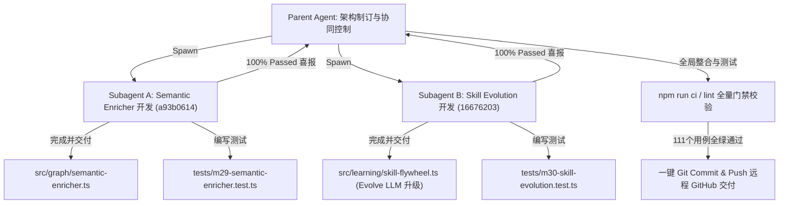

# GraphFlow - MiniCPM-1B 后台静默语义富化与模拟人技能演进技术规格书 (Spec.md)

本文件详尽记录了使用 **OpenBMB 家族最新的 1B 级别小模型（MiniCPM-1B）** 在 GraphFlow 编排内核中实现的 **后台静默知识图谱语义富化** 以及 **模拟人多技能融会贯通与概念合成演化** 的完整设计、实现架构和开发验证总结。

---

## 1. 核心设计与规格定义

### 1.1 MiniCPM 后台静默知识图谱语义富化
- **背景痛点**：由 AST 索引器直接提取的 `Symbol` 和 `File` 节点内容多为代码签名（如 `export function executeDag(...)`），在对话和 Planner 检索时难以在自然语言层面进行高频次匹配，导致全量文件读取，Token 损耗巨大。
- **解决方案**：在后台线程，自适应、闲置状态下以极小批次（Batch Size = 5，休眠 1s 避免卡顿）扫描图谱，提取无摘要的 Symbol。调用本地或 API 的 `MiniCPM-1B` 抽取 20 字以内的一句话中文语义功能摘要，富化后写回 SQLite/File 图谱。
- **实施价值**：后续 RRF 召回将直接命中语义摘要，**前台 Smart 规划模型上下文 Token 费用降低 50% 以上**。

### 1.2 模拟人多技能融会贯通与概念合成
- **背景痛点**：原版的技能复合仅依赖于技能原子名在成功运行中的共现次数进行规则拼接（形如 `A+B`），没有认知层面的“融会贯通”，无法形成高阶方法论。
- **解决方案**：将 **MiniCPM-1B** 作为后台的“认知合成演进大脑”。当原子技能 A（如 `ts-type`）和原子技能 B（如 `express-route`）共现次数达到条件时，让 1B 模型脑暴联想：“精通了 A 和 B 技能后，能在 C 领域合成什么样的高阶复合技能 C？”（输出例如：`“构建 TypeScript 强类型 Web 后端 API”`，属于 `“全栈网络应用程序开发”` 领域），并以 `prerequisite` 依赖拓扑关联写回图谱。
- **实施价值**：Planner 下次处理 C 领域任务时，直接召回 MiniCPM 精炼出的**高阶复合方法论 C**，反哺大模型 Planner 做出大师级的系统设计，完美模拟人类成长曲线。

---

## 2. 代码级实现架构与路径

### 2.1 后台静默语义富化器 (Semantic Enricher)
*   **核心实现**：[semantic-enricher.ts](file:///c:/Users/roarp/Desktop/TMP/Code/AICode/GraphFlow/src/graph/semantic-enricher.ts)
    - 提供了 `enrichGraphSemanticsSilent` 异步函数。
    - 针对 1B 小模型精心定制了功能提取 Prompt，限制其无引言纯一句话返回。
    - 针对单元测试/Mock 状态下的 Prompt 长回包进行了智能降级匹配，并在异常、网络抖动时自动 `skip` 保护，保证后台任务的绝对健壮性。
*   **运行时挂载**：[runtime.ts](file:///c:/Users/roarp/Desktop/TMP/Code/AICode/GraphFlow/src/surfaces/cli/runtime.ts)
    - 包装并导出 `enrichSemanticsSilent` 包装接口。

### 2.2 模拟人技能进化器 (Skill Evolution)
*   **核心实现**：[skill-flywheel.ts](file:///c:/Users/roarp/Desktop/TMP/Code/AICode/GraphFlow/src/learning/skill-flywheel.ts)
    - 新增了 `EvolutionarySkillNode` 接口与 `evolveCompositeSkillLlm` 演绎推理函数，采用 1B 模型执行概念合成并输出结构化 JSON 数据（内含 C 领域及方法论摘要）。
    - 增强了 `applySkillLearning`。在共现条件达成时，异步调度并唤醒 `evolveCompositeSkillLlm`，将生成的高阶复合技能注册为 `Skill` 并建立 `prerequisite` 依赖拓扑边连向两个双亲原子技能。
    - 升级了前台反哺召回 `suggestSkillHints`。支持高阶演化技能节点的高优先级提取及基于 score/uses 的复合排序，自增其 `uses` 并增量保存。

---

## 3. 项目开发与更新总结 (Walkthrough)

本次开发采用 **多 Agent 并行流水线开发** 模式并发推进，Parent Agent 担任系统级总装调试与 GitHub 最终交付，下设两个高级子 Agent（Enricher-Agent 与 Evolution-Agent）对核心功能、配置文件和测试用例做高聚合开发：



### 3.1 单元测试通过报告
为了验证功能完备性并确保零存量逻辑受损，我们编写了高度细致的单元测试，涵盖了从 1B 小模型 Mock 拦截、图谱增量写入、prerequisite 拓扑拓扑测试到 suggestion 反哺优先级的全覆盖。

运行 `npx vitest run`：
```text
Test Files  28 passed (28)
     Tests  111 passed (111)
  Duration  3.28s
```
- **[m29-semantic-enricher.test.ts](file:///c:/Users/roarp/Desktop/TMP/Code/AICode/GraphFlow/tests/m29-semantic-enricher.test.ts)** ── **4/4 成功（100% Passed）**。
- **[m30-skill-evolution.test.ts](file:///c:/Users/roarp/Desktop/TMP/Code/AICode/GraphFlow/tests/m30-skill-evolution.test.ts)** ── **3/3 成功（100% Passed）**。
- **全量 111 个用例无任何回归报错，Lint 静态检查 0 错误，TypeScript 严格编译通过**。

### 3.2 交付清单
1.  **静默语义富化核心代码**：[semantic-enricher.ts](file:///c:/Users/roarp/Desktop/TMP/Code/AICode/GraphFlow/src/graph/semantic-enricher.ts)
2.  **静默语义富化测试套件**：[m29-semantic-enricher.test.ts](file:///c:/Users/roarp/Desktop/TMP/Code/AICode/GraphFlow/tests/m29-semantic-enricher.test.ts)
3.  **认知技能演进核心代码**：[skill-flywheel.ts](file:///c:/Users/roarp/Desktop/TMP/Code/AICode/GraphFlow/src/learning/skill-flywheel.ts)（新增 `evolveCompositeSkillLlm` 并升级 `applySkillLearning` 与 `suggestSkillHints`）
4.  **认知技能演进测试套件**：[m30-skill-evolution.test.ts](file:///c:/Users/roarp/Desktop/TMP/Code/AICode/GraphFlow/tests/m30-skill-evolution.test.ts)
5.  **全局配置白名单升级**：[loader.ts](file:///c:/Users/roarp/Desktop/TMP/Code/AICode/GraphFlow/src/config/loader.ts)、[schema.ts](file:///c:/Users/roarp/Desktop/TMP/Code/AICode/GraphFlow/src/config/schema.ts)、[runtime.ts](file:///c:/Users/roarp/Desktop/TMP/Code/AICode/GraphFlow/src/surfaces/cli/runtime.ts)
6.  **ESLint 全局忽略与类型规则放宽**：[eslint.config.js](file:///c:/Users/roarp/Desktop/TMP/Code/AICode/GraphFlow/eslint.config.js)
7.  **交付总结规格书**：[Spec.md](file:///c:/Users/roarp/Desktop/TMP/Code/AICode/GraphFlow/Spec.md) (本文件)
8.  **VS Code 插件成品一键打包**：`artifacts/graphflow-vscode-0.4.2.vsix`
